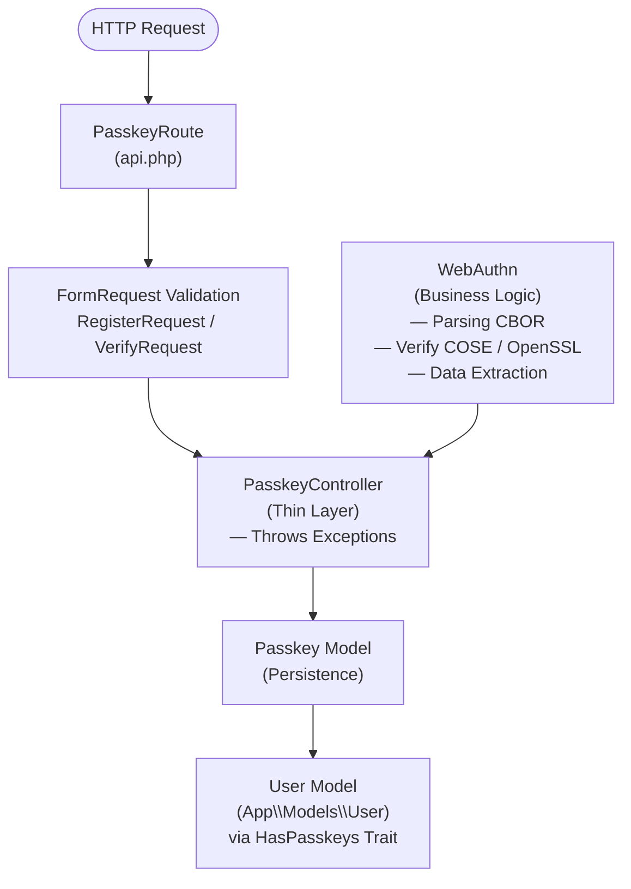
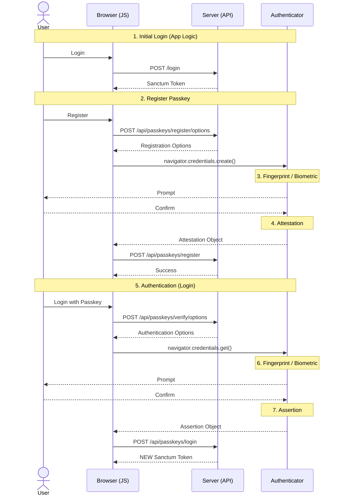

# Laravel Passkey API

A Laravel package for passkey (WebAuthn) authentication.

## Requirements

- PHP 8.1+ (Note: Laravel 11/12 requires PHP 8.2+)
- Laravel 10.x, 11.x, or 12.x
- `spomky-labs/cbor-php`: for CBOR decoding
- `web-auth/cose-lib`: for COSE key handling
- `openssl` PHP extension

> [!TIP]
> [Laravel Sanctum](https://laravel.com/docs/sanctum) is suggested if you want to use the default token-based authentication session, but it is not a hard requirement.

## Installation

Install the package via Composer:

```bash
composer require xefi/laravel-passkey-api
```

The package will automatically register its service provider through Laravel's package auto-discovery.

### Database Setup

Publish and run the migrations:

```bash
php artisan vendor:publish --tag=passkey-migrations
php artisan migrate
```

This will create a `passkeys` table to store passkey credentials.

### Configuration

Optionally publish the configuration file:

```bash
php artisan vendor:publish --tag=passkey-config
```

This creates `config/passkey.php` where you can customize:
- `enabled`: Enable/disable the passkey package (default: `true`, env: `PASSKEY_ENABLED`)
- `timeout`: Passkey operation timeout in milliseconds (default: `60000`, env: `PASSKEY_TIMEOUT`)
- `challenge_length`: Length of the challenge in bytes (default: `32`, env: `PASSKEY_CHALLENGE_LENGTH`)
- `user_model`: The User model class (default: `App\Models\User`, env: `PASSKEY_USER_MODEL`)
- `middleware`: The middleware to apply to passkey routes. You can customize the `auth` middleware (default: `auth:sanctum`).

### User Model Setup

Add the `HasPasskeys` trait to your User model:

```php
use Xefi\LaravelPasskey\Traits\HasPasskeys;

class User extends Authenticatable
{
    use HasPasskeys;

    // ... existing code
}
```

## API Endpoints

The package provides several API endpoints for passkey management and authentication:

### Passkey Management (require authentication)

#### List Passkeys
```http
GET /api/passkeys
Authorization: Bearer <token>
```

Returns a list of passkeys registered for the authenticated user.

#### Get Registration Options
```http
POST /api/passkeys/register/options
Authorization: Bearer <token>
Content-Type: application/json
```

Returns options needed to create a new passkey credential.

**Request Body:**
```json
{
  "app_name": "My Application",
  "app_url": "https://example.com"
}
```

**Response:**
```json
{
  "challenge": "base64-encoded-challenge",
  "rp": {
    "name": "My Application",
    "id": "example.com"
  },
  "user": {
    "id": "base64-encoded-user-id",
    "name": "user@example.com",
    "displayName": "John Doe"
  },
  "pubKeyCredParams": [
    {"type": "public-key", "alg": -7},
    {"type": "public-key", "alg": -257}
  ],
  "timeout": 600000,
  "attestation": "none",
  "authenticatorSelection": {
    "residentKey": "preferred",
    "userVerification": "preferred"
  }
}
```

#### Register Passkey
```http
POST /api/passkeys/register
Authorization: Bearer <token>
Content-Type: application/json
```

Registers a new passkey credential and persists it to the database.

**Request Body:**
```json
{
  "label": "My Security Key",
  "id": "credential-id",
  "rawId": "raw-credential-id",
  "type": "public-key",
  "response": {
    "clientDataJSON": "base64-encoded-client-data",
    "attestationObject": "base64-encoded-attestation"
  }
}
```

**Response:**
```json
{
  "passkey": {
    "id": 1,
    "label": "My Security Key",
    "credential_id": "base64-encoded-credential-id",
    "created_at": "2024-01-19T08:50:00.000000Z"
  }
}
```

### Authentication Flow (public)

#### Get Verification Options
```http
POST /api/passkeys/verify/options
Content-Type: application/json
```

Returns options needed to verify a passkey credential (challenge and allowed credentials).

**Request Body:**
```json
{
  "credential_id": "base64-encoded-credential-id"
}
```

**Response:**
```json
{
  "challenge": "base64-encoded-challenge",
  "allowCredentials": [
    {
      "id": "base64-encoded-credential-id",
      "type": "public-key"
    }
  ],
  "timeout": 60000,
  "userVerification": "preferred"
}
```

#### Verify Passkey
```http
POST /api/passkeys/verify
Content-Type: application/json
```

Verifies a passkey authentication attempt without creating a session. Useful for MFA or re-authentication.

**Request Body:**
```json
{
  "id": "credential-id",
  "rawId": "raw-credential-id",
  "type": "public-key",
  "response": {
    "clientDataJSON": "base64-encoded-client-data",
    "authenticatorData": "base64-encoded-auth-data",
    "signature": "base64-encoded-signature"
  }
}
```

**Response:**
```json
{
  "user": {
    "id": 1
  },
  "passkey": {
    "id": 1
  }
}
```

#### Authenticate (Login)
```http
POST /api/passkeys/login
Content-Type: application/json
```

Authenticates a user via passkey and returns a Sanctum token.

**Request Body:** Same as **Verify Passkey**.

**Response:**
```json
{
  "user": {
    "id": 1,
    "name": "User Name",
    "email": "user@example.com"
  },
  "token": "sanctum-plain-text-token"
}
```

## Usage

After installation, the package routes will be automatically registered. You can verify the routes are available:

```bash
php artisan route:list --path=passkeys
```

### Accessing User Passkeys

You can access a user's passkeys through the relationship:

```php
$user = User::find(1);
$passkeys = $user->passkeys;

foreach ($passkeys as $passkey) {
    echo $passkey->label;
    echo $passkey->created_at;
}
```


## Architecture Pattern

This library follows a clean, service-oriented architecture to maintain the **Single Responsibility Principle**:



> [!NOTE]
> The controller uses Laravel's exception handling mechanism. Errors are thrown as exceptions (`AuthenticationException`, `PasskeyNotFoundException`, `UserNotFoundException`, etc.) rather than returning JSON error responses directly.

## Typical Sequence Flow

Here is the typical sequence of interactions between the Client (Browser), the Server (API), and the Authenticator (Security Key, TouchID, etc.):


