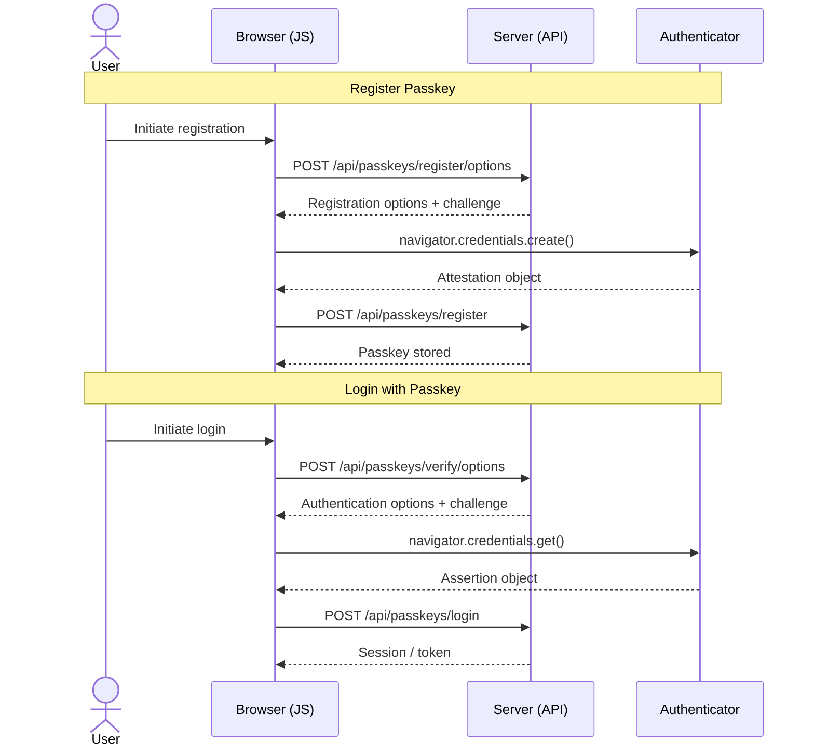

# Laravel Passkey

[](https://packagist.org/packages/xefi/laravel-passkey-api)
[](https://github.com/xefi/laravel-passkey-api/actions/workflows/tests.yml)
[](LICENSE)

A Laravel package for **passkey (WebAuthn/FIDO2)** authentication — register and verify passkeys through a clean REST API, with a swappable authentication action to support Sanctum, Passport, web sessions, or any custom guard.

Full documentation at **[laravel-passkey.xefi.com](https://laravel-passkey.xefi.com/)**.

---

## Requirements

- PHP `^8.3`
- Laravel `^12.0` or `^13.0`

---

## Installation

```bash
composer require xefi/laravel-passkey-api
php artisan vendor:publish --tag=passkey-migrations
php artisan migrate
```

Add the `HasPasskeys` trait to your `User` model:

```php
use Xefi\LaravelPasskey\Traits\HasPasskeys;

class User extends Authenticatable
{
    use HasPasskeys;
}
```

---

## Configuration

```bash
php artisan vendor:publish --tag=passkey-config
```

Key options in `config/passkey.php`:

| Key | Default | Description |
|-----|---------|-------------|
| `enabled` | `true` | Enable / disable the package |
| `timeout` | `60000` | WebAuthn operation timeout (ms) |
| `challenge_length` | `32` | Challenge size in bytes |
| `user_model` | `App\Models\User` | Authenticatable model |
| `auth_action` | `CreateWebSessionAction` | Action invoked on successful login |

---

## Authentication Actions

The login endpoint delegates to a swappable action class. Three are provided out of the box:

```php
// config/passkey.php

// Web session (default)
'auth_action' => \Xefi\LaravelPasskey\Actions\CreateWebSessionAction::class,

// Laravel Sanctum token
'auth_action' => \Xefi\LaravelPasskey\Actions\CreateSanctumTokenAction::class,

// Laravel Passport token
'auth_action' => \Xefi\LaravelPasskey\Actions\CreatePassportTokenAction::class,
```

You can also bind your own implementation of `Xefi\LaravelPasskey\Contracts\PasskeyAuthAction`.

---

## API Endpoints

### Passkey Management *(requires authentication)*

| Method | Endpoint | Description |
|--------|----------|-------------|
| `GET` | `/api/passkeys` | List passkeys for the authenticated user |
| `POST` | `/api/passkeys/register/options` | Get registration options |
| `POST` | `/api/passkeys/register` | Register a new passkey |

### Authentication *(public)*

| Method | Endpoint | Description |
|--------|----------|-------------|
| `POST` | `/api/passkeys/verify/options` | Get verification options |
| `POST` | `/api/passkeys/verify` | Verify a passkey (MFA / re-auth) |
| `POST` | `/api/passkeys/login` | Authenticate and invoke the auth action |

Full request/response schemas are available in the **[documentation](https://laravel-passkey.xefi.com/)**.

---

## Typical Flow



---

## Support us

[](https://www.xefi.com)

Since 1997, XEFI is a leader in IT performance support for small and medium-sized businesses through its nearly 200 local agencies based in France, Belgium, Switzerland and Spain. A one-stop shop for IT, office automation, software, [digitalization](https://www.xefi.com/solutions-software/), print and cloud needs. [Want to work with us?](https://carriere.xefi.fr/metiers-software)

---

## License

MIT — see [LICENSE](LICENSE).
